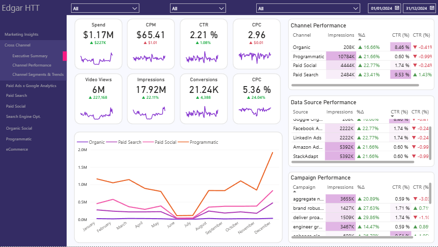

# Marketing Analytics Dashboard

## Overview
End-to-end marketing analytics project that simulates campaign data, builds a dimensional model, and visualizes performance in Power BI.

## Business Problem
Marketing teams need to monitor campaign performance across channels and evaluate ROI, conversions, and growth trends.

## Key Metrics
- Spend:
- CPM:
- CTR:
- CPC:
- Video Views:
- Impressions:
- Conversions:
- CPC:

## Project Architecture
Config (YAML) -> Data Generation -> Data Modeling -> Dashboard

## Dashboard Preview

## Data Model
Star schema with fact and dimension tables:
- fact_marketing_performance
- dim_campaign
- dim_channel
- dim_date
- dim_data_source

## Tools
- Python
- Pandas
- Power BI
- YAML configuration
- Dimensional modeling

## How to Run
1. Install dependencies
2. Run the data generator
3. Open the Power BI dashboard